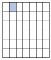
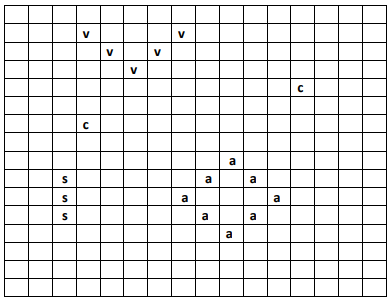

# CS11002 Project Brief

## Introduction

You are being asked to design, document, and implement a new game called "Project Nova". The remainder of this document will describe the game that you are being asked to implement. You will be exploring the requirements and initial designs for the game during the first week of the module. In the final few weeks of the module, you will implement the game in code! Take the opportunity at the beginning of the module to understand the game and think about it in general terms so that you can pick up again easily at the end of the module too.

## Let's get started!

### The premise of the game

The premise of the game is that you are a mystical explorer of the deep oceans of the world trying to rescue the last remaining species of underwater creatures. However, there's a problem.Someone else is looking out for these species too, and they aren't as friendly as you! They want to hunt them down to extinction. You need to identify all the species before they do!

### The game board / surface

In the game, you will be representing the ocean as a two-dimensional grid like the following:

Each box / cell in the grid represents a [latitude, longitude] coordinate in the ocean. Latitude represents the horizontal direction and longitude the vertical direction. For example, in the grid shown above grid, the cell that is colored blue is at a [latitude, longitude] position of [0, 1]

### Where are the creatures?

You can't see them! You need to guess where they are. You will do this by providing the coordinates of a specific grid cell to check, e.g., "I think there's a creature sitting at position [4, 3]". If you are correct in your guess, the creature, or a part of it, will be revealed and you will gain some points. You need to keep guessing to find the parts of all creatures hidden in the grid before your unfriendly opponent does.

### How are the creatures represented?

In a basic version of the game, creatures will be represented using text-based symbols. For example, if there is a crab to find, perhaps it is represented as a letter **c**, occupying one space on the grid. If it is a fish, perhaps it is represented as two consecutive letter **f**'s occurring horizontally or vertically on the grid. It is possible for there to be different types of shapes of creature, e.g., some may be horizontal, some may be vertical, some may be triangular, circular, or v-shaped. These can be of different sizes. For example, the grid below has a V shaped manta-ray on it, two small crabs, an oval-shaped anemone, and medium-sized vertical splitter fish (whatever that is!)

### How the game is played

At the start of the game, you, and the other player will be shown a blank version of the grid which has different creatures hidden within it. Your system will automatically place the hidden creatures at positions on the board ready to be used. Each player will have their own grid, and the positions of the creatures will be different within them. This is because your opponent lives in a topsy-turvy world where the ocean coordinate system is different for them. Players will take turns to guess where the creatures are. On each turn, they will specify the [latitude, longitude] coordinate of where they think a creature might be. If the current player manages to identify a (part of a) creature, they will receive 5 points. Once a part of a creature is identified, in subsequent turns of the game, the player can try further guesses around that same spot on the grid to identify the other parts of the same creature that might be hidden there. Players will receive 5 points for each creature part found. When the player has managed to reveal all parts of a creature, they will receive a further 5-point bonus. If a player guesses a coordinate where there is no (part of a) creature, nothing happens. Whether the guess is successful or not, turn of play shifts to the next player and the current player has to wait their turn to make their next guess. The winner of the game will be the first player to reveal all creatures. Or, if the game finishes prior to that, the winner will be the player with the most points.

### How Does the Game Start?

At the start of the game there will be a menu with the following options:

1. Start a new game
2. Load a previously saved game
3. View Help
4. Exit

When Option 1 is selected, a new game will commence. This involves the following:

- Setting up the two players of the game – the ocean's saviour and their fiendish opponent. Each player can enter a name if they wish. Each player will start off with zero points. Each player may also have a 'health' level from 0 to 100%. This may be used for further features outlined below.
- Setting up the ocean grids. A new grid will be created for each player. Each grid contains the hidden creatures they need to identify. Each grid will contain the same creatures and same number of creatures but at different positions in each player's grid. The creatures can be placed at fixed / pre-defined positions. Or, for extra credit, can be placed randomly.
- Once the grids are set up, the system will determine which player gets to play first and will present them with their turn of play. See **Taking a Turn** below for further details.

When Option 2 is selected, a player can load a previously saved game from a file on disk. They can provide the name of the file to load, or they can be presented with a list of previously saved games to choose from. When loading a game from disk, it should allow a game to be started from where it left off previously. This means it needs to load the previous states of each player's grids and each player's details, e.g., their name, points, health level, and which player it was that has the next turn of play. When the game is loaded, it will re-commence the game by providing the next relevant player with their turn.

When Option 3 is selected, the system should display some instructions for how to play the game.

When Option 4 is selected, the game will exit.

### Taking A Turn of the Game

On each player's turn of the game, the following will happen:

- The player's grid will be displayed showing which (parts of the) creatures they have identified so far and with the remaining creatures still hidden.
- The current scores and health levels for each player will be shown.
- The player will be prompted to enter the coordinates for their next guess.
- There should be an option for the player to save the current state of the game.
- There should be an option for the player to leave / quit the game.

If the player enters coordinates for their guess, the system will check the relevant part of the grid to see if there is a (part of a) creature there. If there is, the player will receive 5 points, plus an extra 5 points if that happens to be the last part of the creature identified. The points will be awarded to the player. If the guess is incorrect, the player will receive no points. In either case, after the guess has concluded, the turn of play will shift to the next player unless the game has been won.

If the player selects the option to save the current game, they will be prompted for the name of a file to save the game into. This will require saving the current state of the grids and the current state of the players. Once the game is saved, the player may resume their turn of the game.

If the player selects the option to leave / quit the game, the game should be ended and return back to the main menu. You could consider whether the player should be prompted if they want to save their current game before leaving.

### When Does the Game End?

The game ends when it is detected that one of the players has found all the undersea creatures. However, additional mechanisms can be adopted too. For example, you may decide that there is a maximum number of turns for each player and whoever has the most points at the end of those turns is the winner. In either case, the winner / loser should be congratulated / commiserated with a relevant message and the game will return to the main menu.

### Extending the Game Even Further

The preceding sections have described the basic version of the game that you will be required to design, document, and implement. If you want, if you have time, and if you feel that you could be capable of adding more advanced functionality into your game, please find some suggestions for this below. You may have some of your own ideas for extra game functionality too. Great! Feel free to explore those too. Please only attempt advanced features if you feel confident.

#### Booby Traps

You could designate certain squares on the board as hidden booby traps. If a player were to select one of the squares during their guess, some unfortunate detriment will occur, e.g., perhaps the player has identified an ocean bomb or deadly jellyfish. In which case, there could be a penalty to the player such as losing a percentage of their points, losing a percentage of their health, or losing their next turn of the game.

#### Power Ups

You could designate certain squares on the board as hidden power ups. If a player were to select one of the squares during their guess, they receive a boost in their health, or an extra turn of the game.

#### Mega Guess

You could designate certain squares on the board as containing a hidden mega guess. If a player were to select this square, it automatically exposes all squares surrounding it within a certain radius, potentially revealing if any creatures are there. If any (parts of) creatures are exposed, the player will receive the points for those.

#### Complex Creature Shapes

When you implement the game, you may wish to start with basic shapes for creatures on the board such as lines and squares. Consider more complex shapes too.

#### Hints

Consider providing a player with the option to receive a hint during their turn of the game. E.g., some clue(s) about which coordinates might contain a creature. If the hint option is used, there should be some penalty to the player, e.g., they lose X points or X amount of health. A more advanced version of this would be to automatically reveal the entire grid, showing the positions for all hidden creatures, but doing so for a short period of time, e.g., 10 seconds, before then hiding the creatures again. The player has to memorise where they saw creatures.

#### Random Placement of Creatures

Create logic that can randomly place creatures on the board at the start of the game, making sure they are placed in valid positions and not falling off the edges of the board.

#### Time limits for Turns

You could consider a time limit for players taking their turns. If they don't take their turn in time, it is forfeited and the turn of play shifts to the next player.

#### A GUI Version of the Game

Can you create a version of the game that has a Graphical User Interface (GUI) instead of a text-based / console version? If you wish to explore this option, a template for a user interface will be provided to you as a starting point.

#### A Computer-based Player?

Would it be possible for a single player of the game to play against the *computer*? Could you incorporate logic that would allow you to automatically make guesses for a computer-based player?

#### Other features of your own

You may have your own ideas too. Great, feel free to incorporate anything else that sounds interesting for you!
